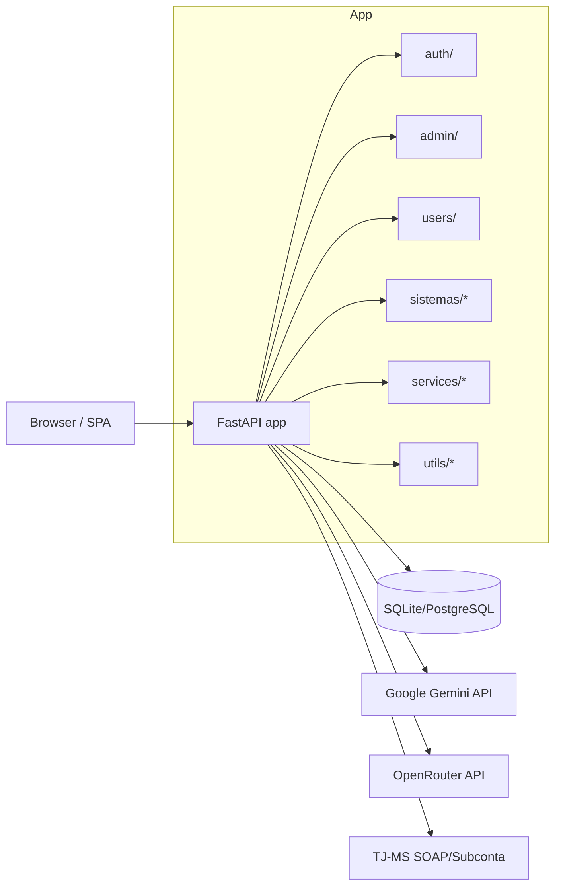

# Arquitetura - Portal PGE-MS

## Visao geral

O Portal PGE-MS e um monolito FastAPI com multiplos sistemas juridicos. A
aplicacao centraliza autenticacao, persistencia e configuracoes, e cada sistema
exp?e sua propria SPA (HTML/JS) e endpoints REST/SSE. Integracoes principais:
Google Gemini (IA), OpenRouter (legado) e TJ-MS (SOAP/Subconta via proxy).

## Diagrama de alto nivel

## Fluxos principais (request -> processamento -> resposta)

### Gerador de pecas (sistemas/gerador_pecas)

1) API recebe `numero_cnj` ou PDFs enviados.
2) Agente 1 coleta documentos no TJ-MS e cria resumo consolidado.
3) Agente 2 detecta modulos de conteudo (LLM ou regras deterministicas).
4) Agente 3 gera a peca em Markdown (Gemini).
5) Resultado e historico sao persistidos em `geracoes_pecas` e `versoes_pecas`.

### Pedido de calculo (sistemas/pedido_calculo)

1) Agente 1 analisa XML do processo (sem IA).
2) Agente 2 extrai informacoes dos PDFs (Gemini).
3) Agente 3 gera o pedido final (Gemini).
4) Logs detalhados de IA ficam em `logs_chamada_ia_pedido_calculo`.

### Prestacao de contas (sistemas/prestacao_contas)

1) Coleta do extrato de subconta (Playwright via proxy local).
2) Coleta e classificacao de documentos do processo.
3) IA produz parecer (favoravel/desfavoravel/duvida).
4) Resultado e logs ficam em `geracoes_prestacao_contas` e `logs_chamada_ia_prestacao`.

### Matriculas confrontantes (sistemas/matriculas_confrontantes)

1) Upload de PDF/imagem.
2) Conversao e analise visual (OpenRouter Vision) + validacoes.
3) Resultado estruturado e relatorio armazenados em `analises`.

### Assistencia judiciaria (sistemas/assistencia_judiciaria)

1) Consulta SOAP no TJ-MS.
2) Parser XML organiza dados basicos e movimentos.
3) IA gera relatorio/parecer (Gemini via call_gemini).
4) Resultado armazenado em `consultas_processos`.

## Contratos internos (interfaces entre modulos)

### services/gemini_service.py

- Entrada: `prompt`, `system_prompt`, `model`, `temperature`, `max_tokens`.
- Saida: `GeminiResponse { success, content, error, tokens_used }`.
- Usado por sistemas que falam diretamente com Gemini (ex.: gerador_pecas, pedido_calculo).

### services/tjms_client.py

- `soap_consultar_processo(numero_processo, movimentos, incluir_documentos) -> XML string`.
- `soap_baixar_documentos(numero_processo, ids_documentos) -> XML string`.
- `extrair_subconta(numero_processo) -> ResultadoSubconta { status, pdf_bytes, texto_extraido, erro }`.
- Config via env: `TJMS_PROXY_URL`, `TJMS_PROXY_LOCAL_URL`, `MNI_USER`, `MNI_PASS`.

### Auth (auth/dependencies.py)

- Token pode vir de cookie `access_token`, header `Authorization: Bearer`, ou query `?token=`.
- Dependencias principais: `get_current_active_user`, `require_admin`.

### Armazenamento local

- PDFs e DOCX temporarios: `sistemas/*/temp_docs`.
- Uploads de matriculas: `sistemas/matriculas_confrontantes/uploads`.
- Logs de auditoria: `logs/audit.log` (via utils/audit.py).

## Integracoes externas

- Google Gemini API (servicos/geracao e extracao).
- OpenRouter API (legado, usado em matriculas_confrontantes).
- TJ-MS SOAP/MNI e Subconta (via proxies; ver `services/tjms_client.py`).
- Playwright para scraping de subconta (prestacao_contas).

## Observabilidade e auditoria

- Audit log em arquivo: `logs/audit.log`.
- Logs de IA em tabelas por sistema (`logs_chamada_ia_*`).
- Endpoint de saude: `GET /health`.

## Pontos nao inferidos com seguranca

- Nao foi encontrado job scheduler ou fila dedicada (ex.: Celery/Redis).
- Nao foi identificado storage externo (S3/GCS). Arquivos ficam em disco local.
